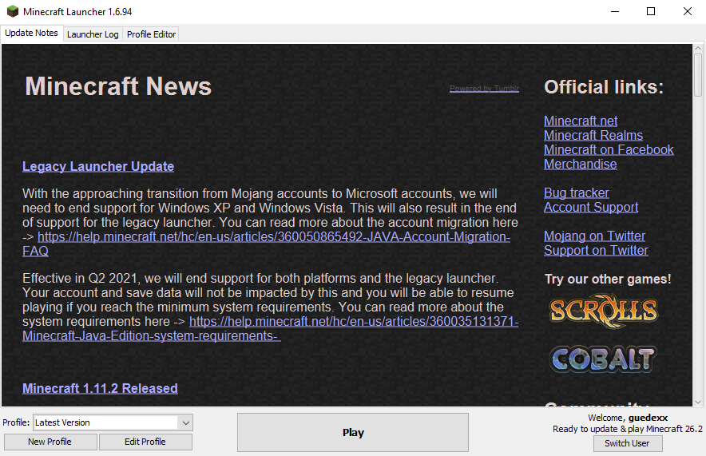

# Guedes' Legacy Minecraft Launcher
A fork of [SkyVerseMc's Legacy Minecraft Launcher](https://github.com/SkyVerseMc/Legacy-Minecraft-Launcher) with the classic launcher UI and Microsoft safe authentication and modern modpack support.

# Features
## Modpack supports
* Modrinth modpack support — done ✔
* Technic modpack support — done ✔
* CurseForge modpack support — WIP 🟡

## Technical features
* Microsoft safe login (using tokens) — done ✔
* Automatic java version selection for old versions — done ✔

# Download
In this repository, you can download both the source code and the compiled launcher. → [Click here](https://github.com/guedexx/Guedes-Legacy-Minecraft-Launcher/releases) to get to the releases page.

# Development
Since I'm the only developer working on the project, updates may take some time to be completed and uploaded, but that doesn't mean development isn't active.

# Disclaimer
This project is an unofficial launcher, which means that it is not affiliated with, endorsed by or associated with Microsoft, Mojang AB or Minecraft.
